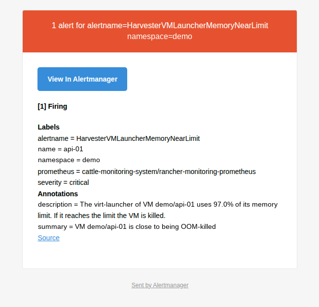

# Alerts

The chart can install a `PrometheusRule` with 24 alerts in four groups (`alerts.enabled=true`; off by default,
because it starts firing into whatever Alertmanager routes you have). Thresholds are chart values (`alerts.thresholds.*`,
defaults below); the rules themselves live in `charts/harvester-extra-dashboards/alerts/harvester-extra-alerts.json`.
Every alert name starts with `Harvester`, which is what the example Alertmanager route in
[../alertmanager](../alertmanager/README.md) matches. Delivering them to a mail catcher for a lab is in
[../mailpit](../mailpit/README.md).

[Back to the overview](README.md)

Alerts have a `for` time: the condition must hold that long before the alert fires, so a short spike shows as
**Pending** in Prometheus (Alerting > Alert rules in Grafana) and never reaches Alertmanager.

## How to react

For each alert: open the dashboard in the last column, find the VM or node named in the alert, and use the
incident routine in the [overview](README.md).

### VM contention (`harvester-extra.vm-contention`)

| Alert | Severity | Fires when (default) | Look at |
|---|---|---|---|
| HarvesterVMCPUReadyHigh | warning | CPU Ready above 5% for 15 m | [Contention](contention.md), Detail v2 |
| HarvesterVMCPUReadyCritical | critical | CPU Ready above 10% for 10 m | same; the host is oversubscribed |
| HarvesterVMGuestMemoryHigh | warning | guest memory in use above 95% for 15 m | Detail v2 memory row |
| HarvesterVMLauncherMemoryNearLimit | critical | launcher memory above 95% of its limit for 10 m | OOM-kill risk; raise the VM's memory |
| HarvesterVMLauncherOOMKilled | critical | a virt-launcher container was OOM-killed | the VM went down; check why before restarting |
| HarvesterVMDiskLatencyHigh | warning | VM disk write latency above 50 ms for 10 m | Contention storage row |
| HarvesterVMLonghornLatencyHigh | warning | Longhorn latency of the VM's volume above 50 ms for 10 m | storage layer: replicas, node disks, network |
| HarvesterVMNetworkDrops | warning | vNIC drops above 10/s for 10 m | Detail v2 network row |

### Host contention (`harvester-extra.host-contention`)

| Alert | Severity | Fires when (default) | Look at |
|---|---|---|---|
| HarvesterNodeOOMKills | warning | the node's kernel killed processes for lack of memory | which pod was killed; node memory |
| HarvesterHostMemoryPressure | warning | memory PSI above 10% for 10 m (needs `psi=1`) | Contention memory row |
| HarvesterHostCPUPressure | warning | CPU PSI above 30% for 15 m (needs `psi=1`) | Contention CPU row |
| HarvesterHostIOPressure | warning | I/O PSI above 40% for 15 m (needs `psi=1`) | Contention storage row |
| HarvesterNodeDiskLatencyHigh | warning | physical disk await above 50 ms for 15 m | the node's disks (SMART, `dmesg`) |
| HarvesterNodeDiskBusy | warning | busiest disk above 95% utilisation for 30 m | the disk is the bottleneck |

The three PSI alerts stay silent until the nodes boot with `psi=1`.

### Capacity and storage (`harvester-extra.capacity-and-storage`)

| Alert | Severity | Fires when (default) | Look at |
|---|---|---|---|
| HarvesterMemoryN1Exceeded | warning | memory requests exceed what is left without the largest host, for 1 h | [Capacity](capacity.md): the cluster cannot lose its biggest host |
| HarvesterHostMemoryRequestsHigh | warning | a node's memory requests above 90% for 30 m | Capacity, per-host panels |
| HarvesterLonghornSchedulingHigh | warning | scheduled storage above 90% for 30 m | Capacity, Disk scheduled |
| HarvesterLonghornSchedulingFull | critical | scheduled storage at 100% for 15 m | Longhorn cannot schedule more replicas |
| HarvesterLonghornNodeStorageHigh | warning | a node's Longhorn disks above 80% used for 30 m | Capacity, Longhorn node storage |
| HarvesterLonghornVolumeDegraded | warning | a volume is degraded for 30 m | rebuilding or missing replica |
| HarvesterLonghornVolumeFaulted | critical | a volume is faulted for 5 m | all replicas failed; act now |

### Backups and snapshots (`harvester-extra.backups-and-snapshots`)

| Alert | Severity | Fires when (default) | Look at |
|---|---|---|---|
| HarvesterBackupStale | warning | a volume's last backup is older than 7 days, for 1 h | [Backup](backup.md) per-VM table |
| HarvesterBackupError | warning | a Longhorn backup ended in Error | the backup job and the backup target |
| HarvesterSnapshotSpaceHigh | warning | snapshots hold over 50% of the used Longhorn space, for 6 h | Backup, largest snapshot consumers |

## What an alert email looks like

With the example Alertmanager route and the Mailpit sink from [../alertmanager](../alertmanager/README.md) and
[../mailpit](../mailpit/README.md), each alert arrives as one mail per alert group. A launcher-memory alert as it appears in the
Mailpit reader (VM and namespace names replaced):



And the text of another one from the lab (names generic), a cluster-wide alert with no VM label:

```
From:     alertmanager@harvester.lab
To:       alerts@example.invalid
Subject:  [FIRING:1] HarvesterMemoryN1Exceeded (cattle-monitoring-system/rancher-monitoring-prometheus warning)

1 alert for alertname=HarvesterMemoryN1Exceeded            [ View In Alertmanager ]

[1] Firing
Labels
  alertname  = HarvesterMemoryN1Exceeded
  prometheus = cattle-monitoring-system/rancher-monitoring-prometheus
  severity   = warning
Annotations
  description = Memory requests are 152% of what the cluster would have after losing its largest host:
                that host's workloads could not be rescheduled.
  summary     = The cluster cannot lose its biggest host
  Source (link to the expression in Prometheus)
```

The subject carries the state (`FIRING:n` or `RESOLVED`), the alert name, the grouping labels and the severity. The
body gives the labels (which VM or node, from the alert's own labels) and the `description` and `summary`
annotations, which already name the number that crossed the threshold. Resolved alerts arrive as a second mail.
The inbox list shows one line per mail, so an alert that keeps repeating (this one was re-sent every few hours)
is easy to spot by its repeated subject.

**The two links.** *View In Alertmanager* and *Source* point at the address the monitoring add-on gives Alertmanager and
Prometheus, which by default is the cluster **VIP**. Opened from a mail that address says "not authorized", because your
Harvester login belongs to the hostname you use for the UI. Set both `externalUrl` values in the `rancher-monitoring`
add-on to that hostname (steps and a checked example in
[../alertmanager](../alertmanager/README.md#links-in-the-mail-set-the-hostname)). Until then, replace the host in the
link by hand and keep the path.


## Checking that they are loaded

```
kubectl -n cattle-monitoring-system get prometheusrule harvester-extra-dashboards-alerts
```

and, in Prometheus (Status > Rules), the four `harvester-extra.*` groups with health `ok`. To change a threshold,
`helm upgrade ... --reuse-values --set alerts.thresholds.cpuReadyWarn=8`.
