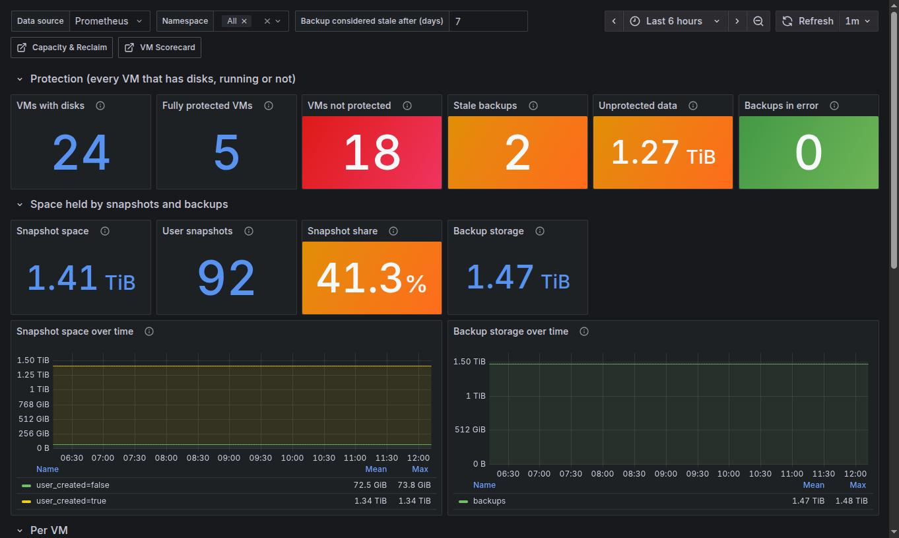
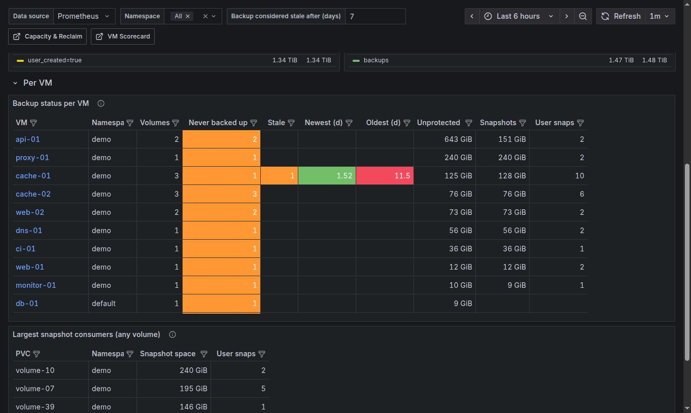

# Backup & Protection

`[SV+] Harvester Backup & Protection` (uid `harvester-backup-v1`). Answers: *which VMs have no backup, which
backups are stale or failing, and how much space do snapshots hold?* It is built from Longhorn's own metrics
(last backup time, backup state, snapshot sizes), so it sees every VM that has a Longhorn volume, running or not.
Variables: namespace and *Backup considered stale after (days)* (default 7).

[Back to the overview](README.md)

## Protection

| Tile | Meaning and what to do |
|---|---|
| VMs with disks | VMs with at least one Longhorn volume: the denominator for the rest |
| Fully protected VMs | All volumes have a backup newer than the stale threshold |
| **VMs not protected** | At least one volume that was **never** backed up. Red when above 0: schedule a backup (or decide consciously that the VM is disposable) |
| **Stale backups** | VMs with a backed-up volume whose last backup is older than the threshold: the schedule broke |
| Unprotected data | Actual size of the never-backed-up volumes (one replica): how much would be lost |
| Backups in error | Longhorn backups in state Error. Should be 0; also covered by an alert |

## Space held by snapshots and backups

* **Snapshot space**: space used by all Longhorn snapshots, one replica. **Snapshots are not backups**: they live
  on the same disks as the volume and grow with changed data.
* **User snapshots**: snapshots created by users or by VM snapshot and backup jobs (not Longhorn's own).
* **Snapshot share**: snapshot space as % of the Longhorn disk space in use. A high share is reclaimable space once
  the snapshots are no longer needed (and the reason `HarvesterSnapshotSpaceHigh` exists).
* **Backup storage**: size of the backups in the backup target.
* **Snapshot space over time** (split by who created them) and **Backup storage over time**: a staircase that only
  goes up means nothing is being pruned.

## Per VM

* **Backup status per VM**: *Volumes*, *Never backed up* (volumes without any backup), *Stale*, *Newest (d)* and
  *Oldest (d)* (age in days of the last backup of the VM's backed-up volumes), *Unprotected* (size of the unbacked
  volumes), *Snapshots* (space) and *User snaps* (count).
* **Largest snapshot consumers (any volume)**: PVCs by space held by snapshots, including volumes that belong to
  no VM. The first place to look to get space back.

## Taking action

Backups and snapshots are managed in the Harvester UI (*Virtual Machines > Take Backup / Take Snapshot*, and
*Advanced > Backups*); this dashboard only tells you where to look. Deleting a snapshot is not reversible, so check
the VM's owner first.
