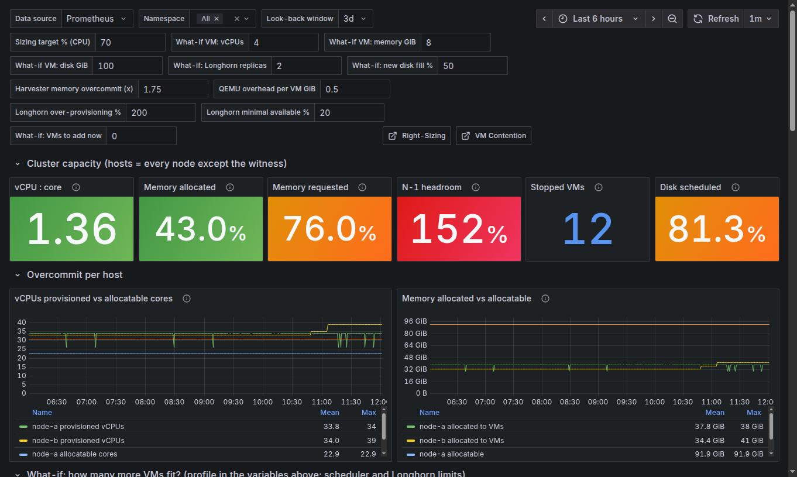
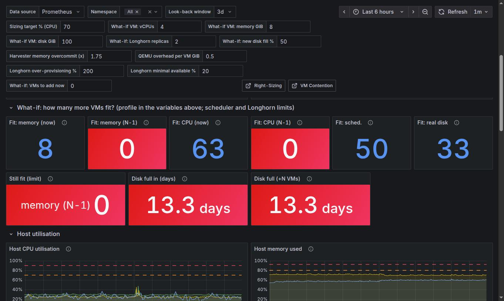
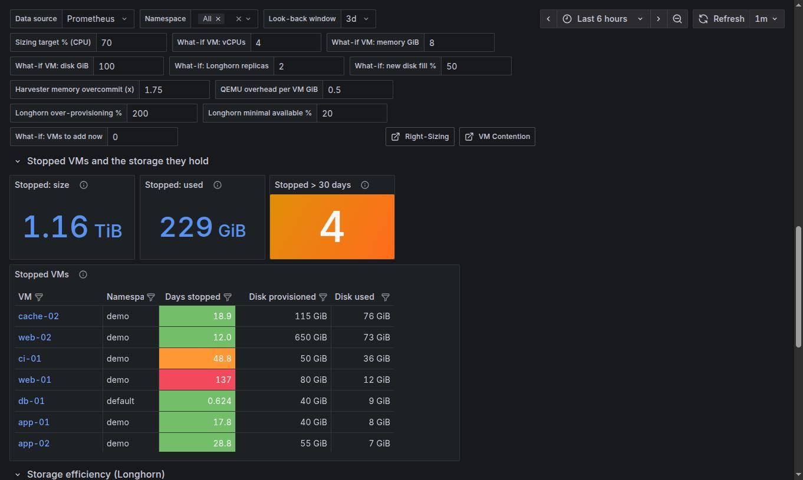
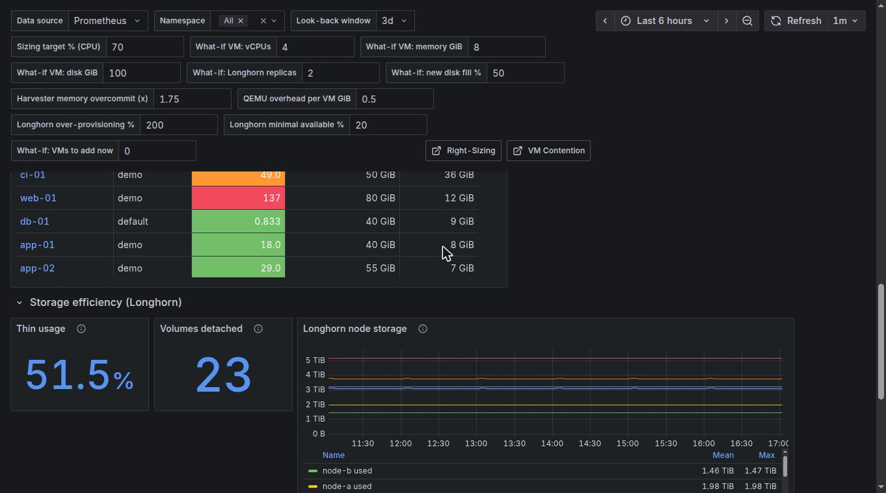
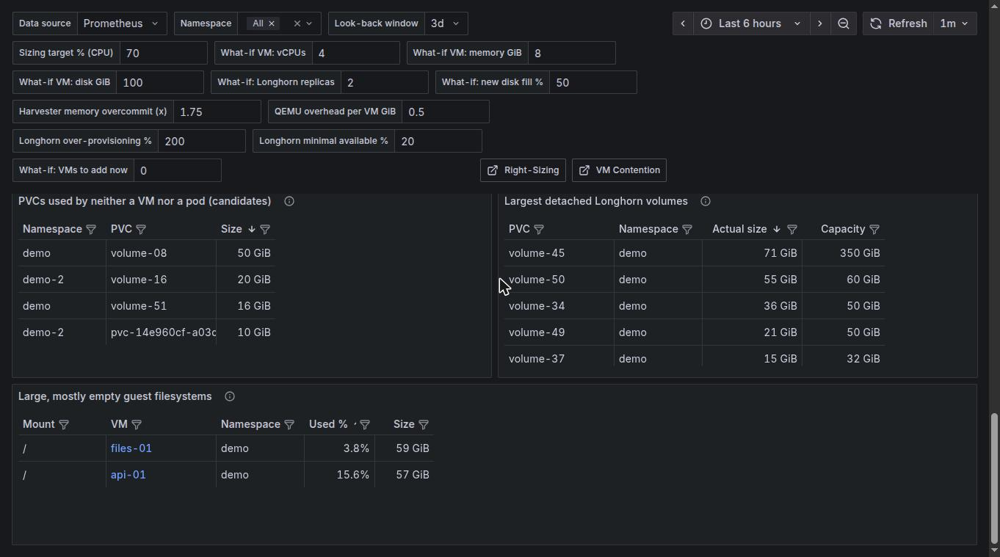

# Capacity & Reclaim

`[SV+] Harvester Capacity & Reclaim` (uid `harvester-capacity-v1`). Answers: *how full is the cluster, can it
lose a host, how many more VMs fit, when does the disk fill, and what space can be taken back?* "Hosts" means
every node except the witness.

[Back to the overview](README.md)

## Cluster capacity and overcommit

| Tile | Meaning and reading |
|---|---|
| vCPU : core | vCPUs of running VMs over the allocatable cores. Harvester overcommits CPU by default, so a ratio above 1 is normal; what matters is CPU Ready on [Contention](contention.md) |
| Memory allocated | Memory allocated to running VMs / allocatable memory |
| Memory requested | Pod memory requests / allocatable memory: what the scheduler sees |
| **N-1 headroom** | Memory requests / (allocatable - the largest host). **Above 100% the cluster cannot reschedule everything if that host fails** |
| Stopped VMs | VMs that are not running |
| Disk scheduled | Storage scheduled (replicas included) over usable Longhorn capacity; Longhorn refuses new volumes beyond its over-provisioning limit |

The two **per host** graphs plot provisioned vCPUs and allocated memory against what each node can allocate.

## What-if: how many more VMs fit?

The first row has six tiles, left to right: *Fit: memory (now)*, *Fit: memory (N-1)*, *Fit: CPU (now)*, *Fit: CPU (N-1)*,
*Fit: sched.* and *Fit: real disk*. The second row holds the limiting resource and the two disk forecasts.

Set the profile of the VM you want to add in the variables (vCPUs, memory GiB, disk GiB, Longhorn replicas,
expected disk fill %) and the cluster settings the calculation depends on (Harvester memory overcommit, QEMU
overhead per VM, Longhorn over-provisioning % and minimal available %).

| Tile | How it is computed |
|---|---|
| Fit: memory (now / N-1) | (allocatable - requested [- largest host]) / (profile memory / overcommit + QEMU overhead) |
| Fit: CPU (now / N-1) | CPU is bounded by real use, not requests: (target % x host cores - host CPU p95) / (profile vCPUs x observed CPU use per vCPU of today's VMs) |
| Fit: sched. | Replicas Longhorn will still schedule: (usable disk x over-provisioning - scheduled) / (disk size x replicas) |
| Fit: real disk | The same by actual free space, keeping the minimal-available reserve, assuming new disks fill to the expected % |
| **Still fit (limit)** | The smallest of memory (N-1), CPU (N-1), Longhorn scheduling and real disk, **and which one is the limit** |
| **Disk full in (days)** | Forecast for the cluster as it is today: days until used space reaches usable capacity minus the reserve, at the growth rate of the look-back window. Does not depend on the what-if VM. Blank when usage is not growing |
| **Disk full (+N VMs)** | The same forecast after adding *What-if: VMs to add now* VMs: their disk x replicas x fill % is taken from the free space first. With 0 VMs it equals the tile on its left; 0 days means the new VMs alone would fill the disk |

Only the "+N VMs" tile reacts to the *VMs to add now* variable; the plain forecast does not. The forecast is only
as good as the window (at most the 5 days Prometheus keeps): a big import or a one-off copy inflates it.

## Host utilisation

**Host CPU utilisation** and **Host memory used** per node, with the 70% and 90% lines, plus a table with the
average and p95 over the look-back window. A host that stays low at p95 has room for VMs; one that is high at p95
has none.

## Stopped VMs and the storage they hold

* **Stopped: size** (provisioned) and **Stopped: used** (Longhorn actual thin size, one replica): what stopped
  VMs hold. *Used* x replicas is what you get back by deleting them.
* **Stopped > 30 days**: VMs stopped for more than a month.
* **Stopped VMs** table: days since it stopped (blank when Harvester has no timestamp), provisioned and used disk.
  Candidates to delete, archive or export; the VM name opens its detail page.

## Storage efficiency (Longhorn)

* **Thin usage**: actual size of Longhorn volumes over their capacity. **Volumes detached**: not attached to a
  workload right now (this includes the disks of stopped VMs).
* **Longhorn node storage**: per node, disk usage, scheduled storage and capacity.
* **PVCs used by neither a VM nor a pod (candidates)**: PVCs on Harvester storage classes, outside system
  namespaces, that nothing references. **Review before deleting**: a PVC can be kept for a purpose this dashboard
  cannot see.
* **Largest detached Longhorn volumes**: where the space sits while nothing uses it.
* **Large, mostly empty guest filesystems**: filesystems over 10 GiB that are under 20% used (guest agent): disks
  provisioned far larger than needed.
