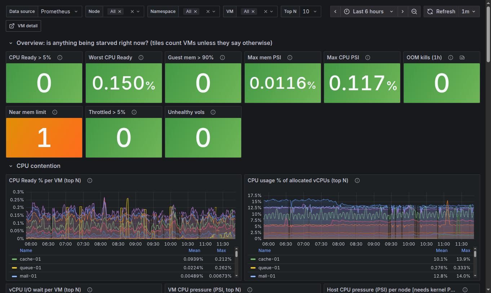
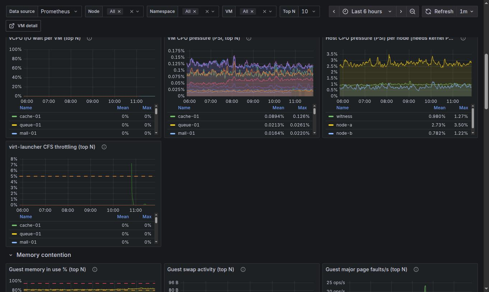
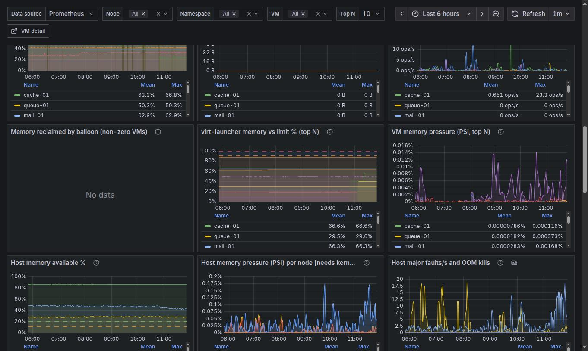
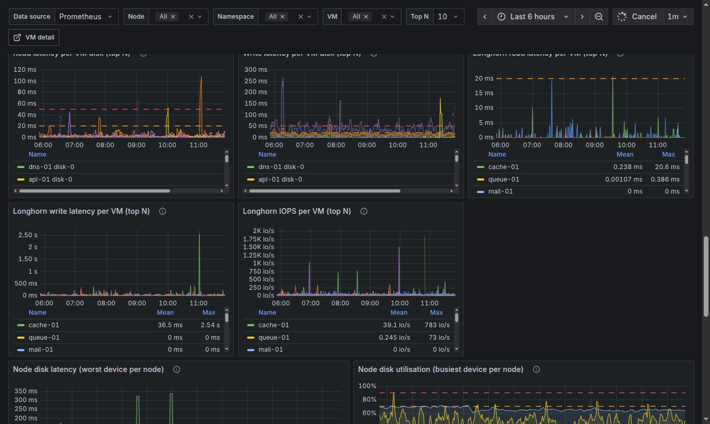
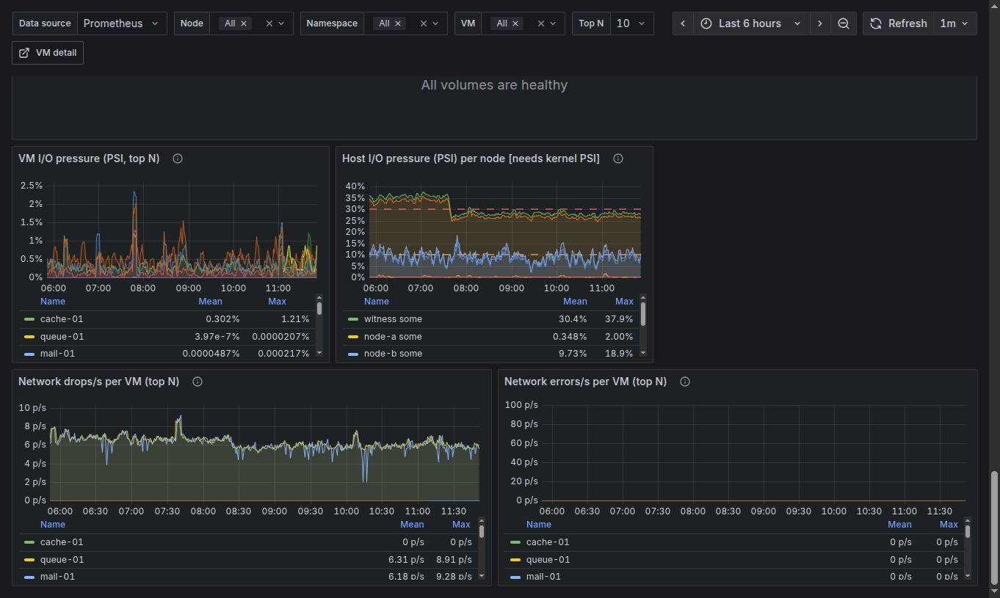

# VM Contention

`[SV+] Harvester VM Contention` (uid `harvester-vm-contention-v1`). Answers: *is anything being starved, by what,
and on which VM or node?* Variables: node, namespace, VM, Top N (how many series the "top N" graphs draw).

[Back to the overview](README.md)

## Overview tiles

All tiles count **VMs** unless they say otherwise. Green is the normal state.

| Tile | What it counts | How to read / what to do |
|---|---|---|
| CPU Ready > 5% | VMs whose vCPUs are runnable but not scheduled more than 5% of the time | The vSphere rule of thumb: >5% warning, >10% problem. Open the VM in Detail v2; if its own CPU usage is low, the host is oversubscribed: move VMs away or add hosts |
| Worst CPU Ready | The highest CPU Ready % of any VM | Same signal as a number; use it to see how far from 5% you are |
| Guest mem > 90% | VMs whose guest OS has less than 10% memory available (page cache is *not* counted as used) | Needs qemu-guest-agent. Grow the VM or fix the application |
| Max mem PSI | Highest share of the last 5 minutes a VM's cgroup stalled waiting for memory on the host | Any sustained value means the host is reclaiming memory from that VM |
| Max CPU PSI | Highest share of time a VM's cgroup waited for a CPU (throttling plus run-queue) | Complements CPU Ready from the host side |
| OOM kills (1h) | Kernel OOM kills on the nodes plus OOM events of launcher containers in the last hour | A launcher OOM kill takes the VM down. Non-zero deserves a look the same day |
| Near mem limit | VMs whose launcher uses more than 90% of its memory limit | OOM-kill risk for the VM. Raise the VM's memory (the limit follows) or find why overhead grew |
| Throttled > 5% | VMs whose launcher hit its CPU limit in more than 5% of scheduling periods | Only relevant when CPU limits are set |
| Unhealthy vols | Longhorn volumes that are degraded or faulted | A replica is missing or rebuilding; writes slow down meanwhile |

## CPU contention

Graphs, one line per VM (top N):

* **CPU Ready % per VM**: time vCPUs waited for a physical CPU, averaged over the vCPUs. The vSphere "CPU Ready"
  analogue. Read it **together with** the usage graph next to it: high ready with low usage means the host, not
  the guest, is the bottleneck.
* **CPU usage % of allocated vCPUs**: guest plus hypervisor CPU time as % of the VM's vCPUs.
* **vCPU I/O wait per VM**: time vCPUs were blocked on I/O. Not CPU steal: it points at storage.
* **VM CPU pressure (PSI)**: the host cgroup's view of the same waiting.
* **Host CPU pressure (PSI) per node**: kernel pressure per node; needs `psi=1`.
* **virt-launcher CFS throttling**: share of periods the launcher container was throttled by its CPU limit.

## Memory contention

* **Guest memory in use %** (upper row, not shown above): `100 * (1 - MemAvailable/total)` from the guest agent.
  Unlike the stock Harvester panel it does not count reclaimable page cache as used, so it is closer to vSphere
  "Active" memory. Dashed lines mark the warning and critical levels.
* **Guest swap activity** and **Guest major page faults/s**: sustained non-zero values mean the guest is short of
  memory and thrashing.
* **Memory reclaimed by balloon**: memory the hypervisor took back. Harvester does not inflate balloons by
  default, so "No data" is the normal result.
* **virt-launcher memory vs limit %**: working set of the launcher container against its limit. Close to 100% the
  launcher (guest RAM plus QEMU overhead) is about to be OOM-killed. This is the panel behind the *Near mem limit*
  tile and the `HarvesterVMLauncherMemoryNearLimit` alert.
* **VM memory pressure (PSI)**: host-side memory contention as each VM sees it.
* **Host memory available %** (dashed lines at 20% and 10%), **Host memory pressure (PSI)** (*some* = at least one
  task waited, *full* = all non-idle tasks stalled) and **Host major faults/s and OOM kills**.

## Storage and network contention

* **Read / Write latency per VM disk**: average time per I/O as the VM sees it (`rate(times)/rate(iops)`), the
  vSphere virtual-disk latency. Dashed lines at 20 and 50 ms.
* **Longhorn read / write latency per VM**: the latency Longhorn measures for the VM's worst volume (the layer
  under the VM disk). **Compare the two rows**: only Longhorn high means replicas, disks or the network between
  nodes; both high with Longhorn quiet means the guest. Writes wait for every replica, so a rebuilding or slow
  replica shows up here first.
* **Longhorn IOPS per VM**: read plus write IOPS of the VM's volumes.
* **Node disk latency (worst device per node)** and **Node disk utilisation (busiest device per node)**: the
  physical disks. Sustained 90-100% utilisation means the disk is the bottleneck. Utilisation is clamped to 100%
  (a disk that resets its I/O counters would otherwise draw impossible values).
* **Degraded or faulted Longhorn volumes**: a table; "All volumes are healthy" is the good state.

* **VM I/O pressure (PSI)** and **Host I/O pressure (PSI) per node**: share of time waiting for block I/O.
* **Network drops/s** and **Network errors/s per VM**: vNIC rx plus tx. Look for a sudden change against the VM's own
  baseline rather than for an absolute number.
