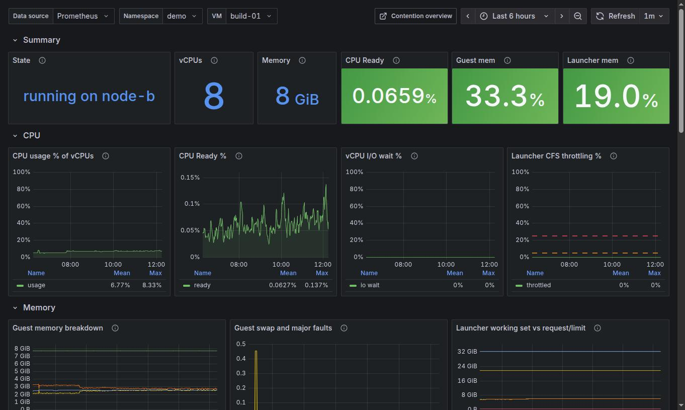
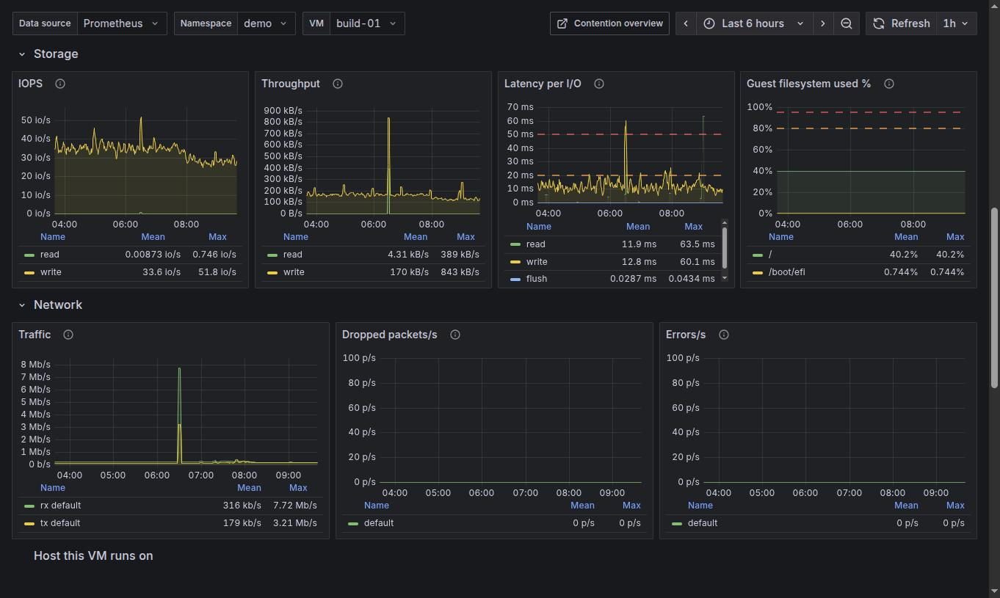
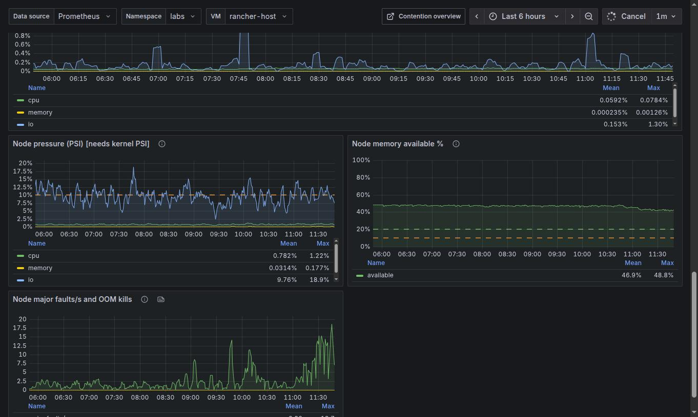

# VM Info Detail v2

`[SV+] Harvester VM Info Detail v2` (uid `harvester-vm-detail-v2`). One VM, every layer. Reach it from any VM
name in the other dashboards, or pick namespace and VM at the top. Replaces the stock *VM Info Detail* for
troubleshooting; the stock dashboard stays installed.

[Back to the overview](README.md)

## Summary and CPU

| Panel | Meaning |
|---|---|
| State | Phase of the VM and the node it runs on |
| vCPUs / Memory | What the VM is allocated |
| CPU Ready | Time the vCPUs waited for a physical CPU (green below 5%) |
| Guest mem | `100 * (1 - MemAvailable/total)`; needs qemu-guest-agent |
| Launcher mem | Working set of the virt-launcher container over its memory limit |

CPU row: **CPU usage % of vCPUs**, **CPU Ready %** (the vSphere CPU Ready analogue), **vCPU I/O wait %** (vCPUs
blocked on I/O) and **Launcher CFS throttling %** (share of periods the CPU limit was hit). A VM at low usage with
high CPU Ready is being starved by the host.

## Memory

* **Guest memory breakdown**: *available* is the total seen by the guest, *usable* is `MemAvailable` (free plus
  reclaimable), *unused* is completely free, *cached* is page cache. In use = available - usable.
* **Guest swap and major faults**: swap traffic over 5 minutes and major page faults per second.
* **Launcher working set vs request/limit**: host-side memory of the launcher pod against what it is allowed;
  a working set approaching the limit is an OOM risk.

## Storage and network

* **IOPS** and **Throughput**: read and write per second.
* **Latency per I/O**: `rate(times)/rate(ops)` per read, write and flush. The stock dashboard's "IO Time" shows
  the raw rate of the time counter, which is not a latency.
* **Guest filesystem used %**: per mount point, from the guest agent. Dashed lines at 80% and 95%.
* **Traffic**, **Dropped packets/s**, **Errors/s** per interface.

## Host this VM runs on

* **VM cgroup pressure (PSI)**: share of time this VM's launcher cgroup stalled on CPU, memory or I/O (cAdvisor).
* **Node pressure (PSI)** [needs kernel PSI]: CPU, memory and I/O pressure of the hosting node (*some*).
* **Node memory available %**: `MemAvailable/MemTotal` of the node, dashed lines at 20% and 10%.
* **Node major faults/s and OOM kills**: whether the node itself is swapping or killing processes.

If the VM's own panels look fine but the host row is red, the cause is on the node: look at the other VMs on it in
the [Contention](contention.md) dashboard.
