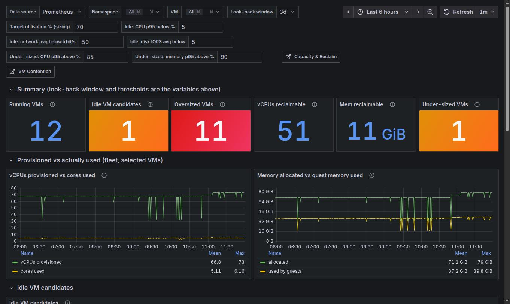
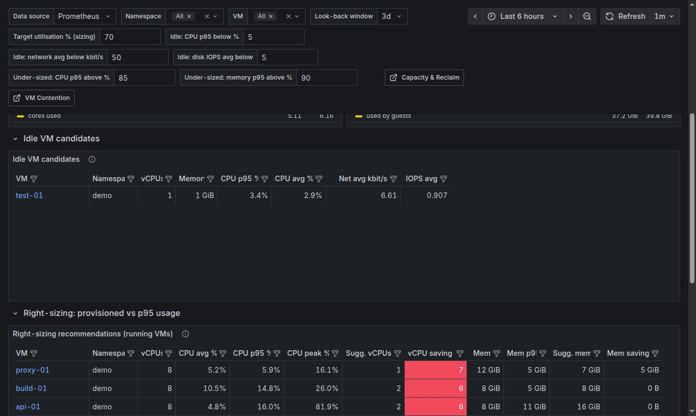
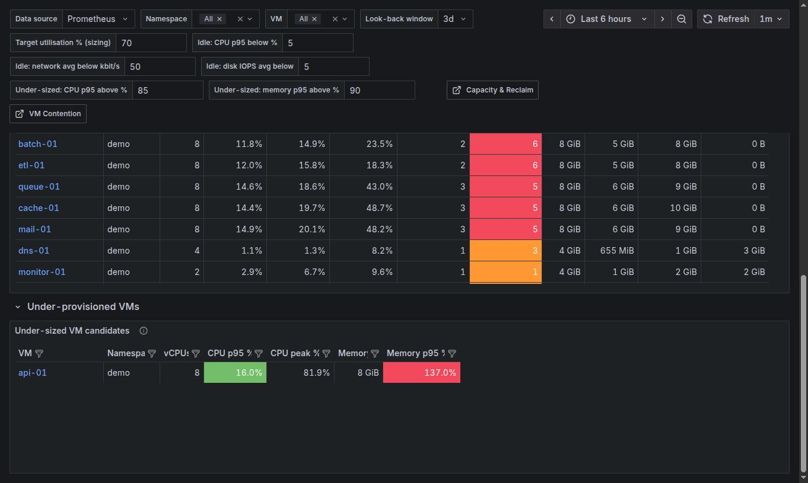

# Right-Sizing

`[SV+] Harvester Right-Sizing` (uid `harvester-rightsizing-v1`). Answers: *which running VMs are idle, oversized or
undersized?* It compares what each VM is provisioned with against what it used over a look-back window.

[Back to the overview](README.md)

**Read this first.** Prometheus keeps 5 days on Harvester by default, so the window (default 3 days) is short. Treat
the result as a first filter and confirm with the owner: a VM that works only at month end looks idle in 3 days.
The memory columns are empty for VMs without qemu-guest-agent.

## Variables

| Variable | Default | Effect |
|---|---|---|
| Look-back window | 3d | Period used for p95, averages and peaks |
| Target utilisation % (sizing) | 70 | Suggested size = p95 usage / target |
| Idle: CPU p95 below % | 5 | A VM is idle only if all three idle tests pass |
| Idle: network avg below kbit/s | 50 | |
| Idle: disk IOPS avg below | 5 | |
| Under-sized: CPU p95 above % / memory p95 above % | 85 / 90 | Thresholds for the under-sized table |

## Summary and fleet totals

| Tile | Meaning |
|---|---|
| Running VMs | VMs with a running instance in the selection |
| Idle VM candidates | Running VMs under all three idle thresholds for the whole window: candidates to power off or remove |
| Oversized VMs | VMs whose p95 usage would fit in fewer vCPUs or less memory at the target utilisation |
| vCPUs reclaimable | Sum of (provisioned vCPUs - vCPUs needed for p95 CPU at the target) |
| Mem reclaimable | Sum of (allocated memory - memory needed for p95 guest usage at the target) |
| Under-sized VMs | VMs above the under-sized CPU or memory p95 thresholds |

The two graphs below show the fleet: **vCPUs provisioned vs cores used** and **Memory allocated vs guest memory
used**. A wide gap that stays wide is the case for consolidating.

## Idle candidates and recommendations

* **Idle VM candidates** lists VMs that passed all three tests, with their CPU p95 and average, network and IOPS.
* **Right-sizing recommendations (running VMs)**: for each VM the provisioned size, CPU average / p95 / peak,
  *Sugg. vCPUs* (p95 / target, rounded up to whole cores), *vCPU saving* (cells coloured by how many vCPUs), and
  the memory equivalents. *CPU peak %* shows how far spikes went, so a VM with a low p95 but a high peak is not
  shrunk blindly. Click the VM name to open its Detail v2 page.

## Under-provisioned VMs

VMs whose CPU p95 or guest-memory p95 is above the thresholds. A memory p95 above 100% means the guest is using
more than it was given and is swapping or has just been resized (a resize inside the window still carries the old
size in the p95). **Before adding vCPUs, check CPU Ready on [Contention](contention.md)**: high usage with high
CPU Ready is a shortage of host CPU, not of vCPUs.
