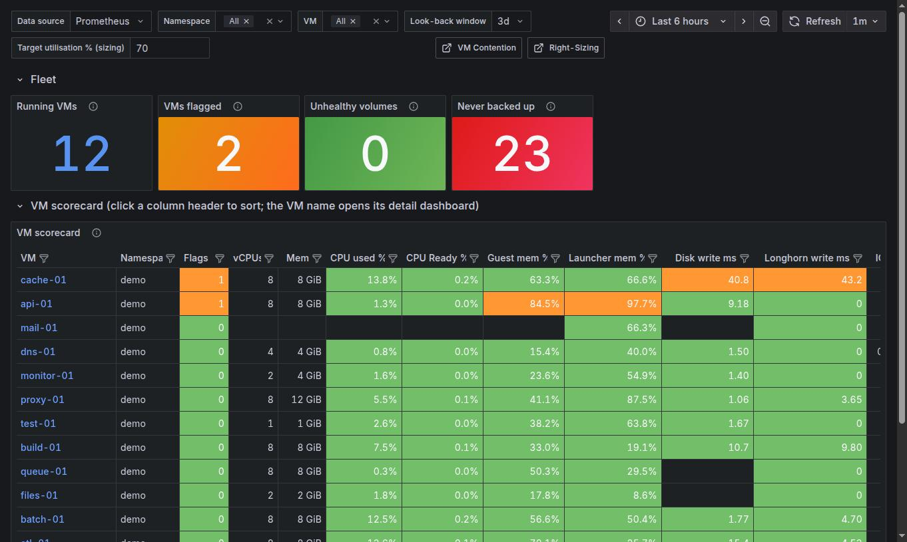
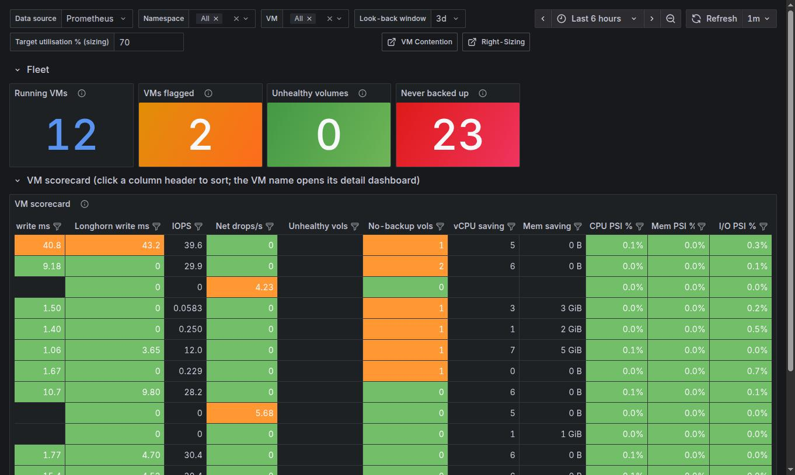

# VM Scorecard

`[SV+] Harvester VM Scorecard` (uid `harvester-vm-scorecard-v1`). One row per running VM, one column per thing that
can be wrong. The daily starting point: sort, find the red or orange cell, open the VM. Variables: namespace, VM,
look-back window and target utilisation (the last two only feed the saving columns).

[Back to the overview](README.md)

## Fleet tiles

| Tile | Meaning |
|---|---|
| Running VMs | VMs with a running instance in the selection |
| VMs flagged | Running VMs over at least one warning threshold (see *Flags* below) |
| Unhealthy volumes | Longhorn volumes degraded or faulted (detached volumes report "unknown" and are not counted) |
| Never backed up | Volumes of VM disks with no Longhorn backup ever recorded |

## The table

The table is wider than the screen: scroll sideways. Click a header to sort, use the filter icon to search; **the
VM name opens its Detail v2 page**.

| Column | Meaning | Warning level |
|---|---|---|
| **Flags** | Number of the checks below that are over their warning level | 1 orange, 3 red |
| vCPUs, Mem | Provisioned size | |
| CPU used % | CPU use as % of the vCPUs | |
| CPU Ready % | Time waiting for a physical CPU | above 5% |
| Guest mem % | Memory in use inside the guest (guest agent; blank without it) | above 90% |
| Launcher mem % | Launcher working set over its memory limit | above 90% |
| Disk write ms | VM-side average write latency | |
| Longhorn write ms | Longhorn's write latency for the VM's volumes | above 20 ms |
| IOPS | Read plus write IOPS of the VM's volumes | |
| Net drops/s | vNIC drops | above 10/s |
| Unhealthy vols | Degraded or faulted volumes of the VM | any |
| No-backup vols | Volumes that were never backed up | informational |
| vCPU saving, Mem saving | Right-sizing suggestion from the [Right-Sizing](rightsizing.md) dashboard | |
| CPU / Mem / I/O PSI % | Share of time the VM's cgroup stalled on that resource (needs PSI on the node) | |

A blank cell means "no data" (for example no guest agent), not zero. *Flags* counts six checks: CPU Ready, guest
memory, launcher memory, Longhorn write latency, network drops and unhealthy volumes. Backups are shown but do not
raise a flag.
